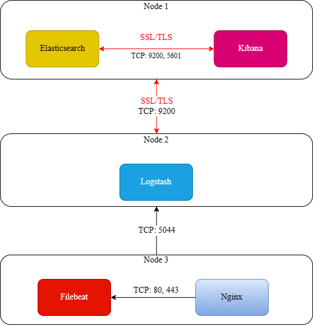
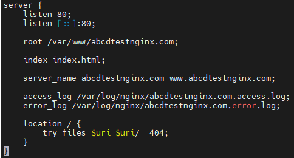
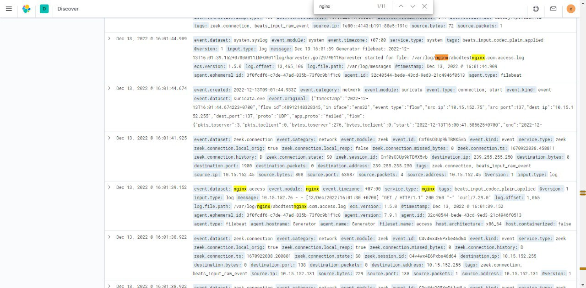
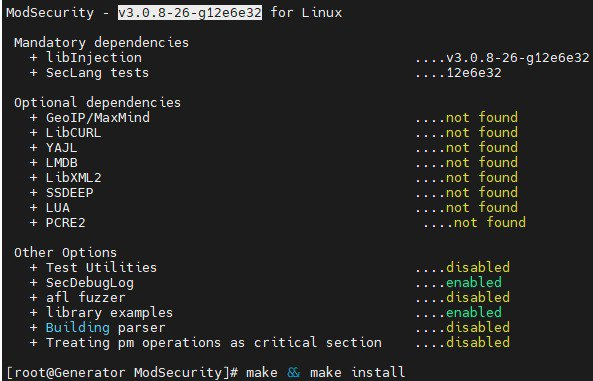
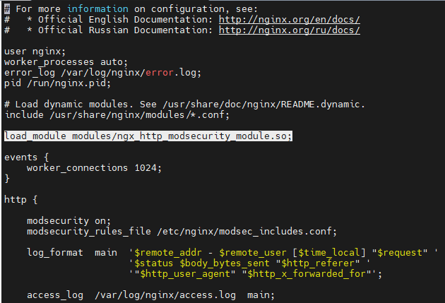
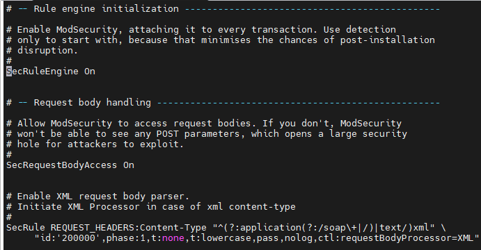
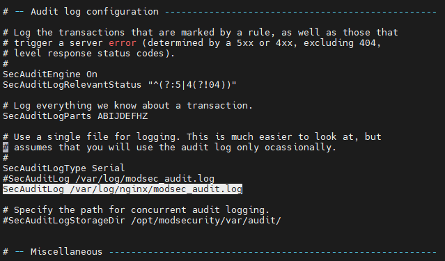

# Configure NGINX and secure NGINX with Mod-security (WAF)

# Table of Contents
1. [Nginx](#1-nginx)  
1.1 [Khái niệm](#11-khái-niệm)  
1.2 [Một số khái niệm đi kèm](#12-một-số-khái-niệm-đi-kèm)  
1.3 [Đặc trưng](#13-đặc-trưng)  
1.4 [Một số ứng dụng phổ biến](#14-một-số-ứng-dụng-phổ-biến)  
1.5 [Cấu hình Nginx](#15-cấu-hình-nginx)  
1.5.1 [Sơ đồ triển khai](#151-sơ-đồ-triển-khai)  
1.5.2 [Các bước thực hiện](#152-các-bước-thực-hiện)  
1.5.2.1 [Cài đặt Nginx (Hệ điều hành CentOS)](#1521-cài-đặt-nginx-hệ-điều-hành-centos)  
1.5.2.2 [Kiểm tra log đã tạo, thu log đẩy về Filebeat, xem log trong Kibana](#1522-kiểm-tra-log-đã-tạo-thu-log-đẩy-về-filebeat-xem-log-trong-kibana)
2. [WAF](#2-waf)  
2.1 [Khái niệm](#21-khái-niệm)  
2.2 [HA](#22-ha)  
2.3 [Modsecurity](#23-modsecurity)  
2.4 [Cấu hình tích hợp Modsecurity cho Nginx](#24-cấu-hình-tích-hợp-modsecurity-cho-nginx)  
2.4.1 [Sơ đồ triển khai](#241-sơ-đồ-triển-khai)  
2.4.2 [Các bước thực hiện](#242-các-bước-thực-hiện)  
2.4.2.1 [Cài đặt các dependencies cần thiết, biên dịch Modsecurity](#2421-cài-đặt-các-dependencies-cần-thiết-biên-dịch-modsecurity)  
2.4.2.2 [Tạo Modsecurity modules cho Nginx, cài đặt OWASP rule](#2422-tạo-modsecurity-modules-cho-nginx-cài-đặt-owasp-rule)  
2.4.2.3 [Kiểm tra hoạt động của Modsecurity](#2423-kiểm-tra-hoạt-động-của-modsecurity)

## 1. Nginx
### 1.1 Khái niệm
- **Nginx**(Đọc là engine X) là web server mã nguồn mở, được tạo ra để đáp ứng nhu cầu về dịch vụ web, reverse proxy (proxy ngược), caching (lưu đệm), load balancer (cân bằng tải), media streaming và nhiều tính năng khác.
- Nginx được thiết kế để có hiệu suất và độ ổn định tối ưu. Ra mắt vào năm 2004, đến nay Nginx đã và đang dần thay thế web server Apache bởi các ưu điểm tuyệt vời của nó.
- Ngoài phục vụ cho dịch vụ web (HTTP), Nginx còn được dùng làm reverse proxy cho email (IMAP, POP3, SMTP), đồng thời làm reverse proxy và cân bằng tải cho cả TCP và UDP.

### 1.2 Một số khái niệm đi kèm
- **Proxy server**: Đóng vai trò như là 1 server trung gian giữa client yêu cầu tài nguyên và máy chủ cung cấp tài nguyên đó. Proxy hiện đại ngoài chuyển tiếp yêu cầu web còn bảo mật dữ liệu và hiệu suất mạng. Proxy hoạt động như 1 firewall (tường lửa) và web filter (bộ lọc web), cung cấp các kết nối mạng được chia sẻ và lưu trữ dữ liệu trong bộ nhớ cache giúp tăng tốc các request phổ biến. 1 proxy tốt giúp bảo vệ user và mạng nội bộ (internal network) khỏi những thứ xấu tồn tại trên internet.
- **Reverse proxy** (proxy ngược):
  - Là 1 server đặt trước 1 hoặc nhiều web server, can thiệp các yêu cầu (request) được gửi từ máy khách (client) (**khác với proxy chuyển tiếp**). Với proxy ngược, khi client gửi yêu cầu tới server gốc của trang web, các yêu cầu này sẽ bị chặn ở biên mạng bởi server proxy ngược. Nếu hợp lệ, server proxy ngược này sẽ luân chuyển những yêu cầu này đến server gốc của trang web. Ưu điểm lớn nhất của proxy ngược là quản lý tập trung, giúp kiểm soát mọi yêu cầu từ client gửi đến các server đang được bảo vệ.
  - _Công dụng_: 
    - Che dấu sự tồn tại và các đặc điểm của server thực sự cung cấp tài nguyên.
    - Có thể hoạt động như 1 application firewall giúp chống lại các cuộc tấn công như từ chối dịch vụ (DoS), từ chối dịch vụ phân tán (DDoS), ...
    - Trong trường hợp trang web được bảo mật, web server có thể không tự thực hiện mã hóa TLS mà ủy quyền nhiệm vụ này sang 1 proxy ngược được trang bị phần cứng tăng tốc TLS (TLS acceleration hardware)
    - Cache (lưu đệm) các nội dung tĩnh như hình ảnh, tập tin ,... giúp giảm tải web server.
    - Cân bằng tải: chia đều request từ client đến các server.
- **Caching** (lưu đệm):
  - _Cache_: 
    - Là lớp lưu trữ dữ liệu tốc độ cao lưu 1 tập con các dữ liệu, thường có tính chất tạm thời, để các request trong tương lai đối với data đó được cung cấp nhanh hơn bằng cách truy cập vào vị trí lưu trữ chính của dữ liệu. Lưu cache cho phép sử dụng lại dữ liệu đã truy xuất hoặc đã tính toán trước đó 1 cách hiệu quả. 
    - Dữ liệu trong cache thường được lưu trong phần cứng truy cập nhanh (VD như RAM (Random Access Memory), ...), cũng có thể sử dụng tương quan với 1 thành phần phần mềm. Mục đích chính của cache là tăng hiệu xuất truy xuất dữ liệu bằng cách giảm nhu cầu truy cập lớp lưu trữ có tốc độ chậm hơn ở bên dưới.
    - Đánh đổi dung lượng lấy tốc độ, cache thường lưu trữ 1 tập con dữ liệu tạm thời, trái ngược với database thường có dữ liệu đầy đủ, lâu bền
  - _Caching_: là quá trình lưu trữ các bản sao của tệp trong cache, hoặc vị trí lưu trữ tạm thời để có thể truy cập dữ liệu nhanh hơn.

### 1.3 Đặc trưng
- Nginx dễ cấu hình để phục vụ cho các web có nội dung tĩnh (static content) hoặc hoạt động như 1 proxy server. 
- Nginx cũng có thể được triển khai để phục vụ nội dung động (dynamic content) trên mạng bằng việc sử dụng FastCGI, trình xử lý SCGI đối với scripts, máy chủ ứng dụng WSGI hoặc module Phusion Passenger, bộ cân bằng tải phần mềm.
- Nginx sử dụng hướng tiếp cận theo hướng sự kiện (event-driven) và bất đồng bộ (asynchronous) thay vì hướng tiếp cận theo các luồng để xử lý các request. Kiến trúc hướng sự kiện theo module của Nginx có thể cung cấp việc dự đoán hiệu suất trong điều kiện tải cao.
- Các tính năng của HTTP proxy và Web server: 
  - Khả năng xử lý hơn 10.000 kết nối đồng thời với dung lượng bộ nhớ thấp (~2,5Mb/10k kết nối HTTP không hoạt động)
  - Xử lý các file tĩnh, file index, tự động lập chỉ mục (auto-indexing)
  - Proxy ngược và lưu đệm
  - Cân bằng tải cùng với kiểm tra tình trạng trong băng tần
  - SSL/TLS với SNI và hỗ trợ OCSP stapling, thông qua OpenSSL
  - Hỗ trợ FastCGI, SCGI, uWSGI với lưu đệm
  - Hỗ trợ gRPC kể từ tháng 3 năm 2018, phiên bản 1.13.10
  - Server ảo dựa theo tên và địa chỉ IP
  - Tương thích với IPv6
  - WebSocket kể từ 1.3.13, bao gồm hoạt động như 1 proxy ngược, thực hiện cân bằng tải cho các ứng dụng WebSocket
  - Rewriting, chuyển hướng URL
- Các tính năng của proxy mail:
  - Hỗ trợ SSL/TLS, STARTTLS
  - SMTP, POP3, IMAP proxy. 
  - Yêu cầu xác thực bằng máy chủ HTTP bên ngoài hoặc các script xác thực.

### 1.4 Một số ứng dụng phổ biến
- **Web Server**: Khi Nginx mới ra mắt, các trang web phần lớn là các trang HTML cơ bản với nội dung chủ yếu là tĩnh. Ngày nay các trang web có nhiều nội dung động và hầu hết là đã chuyển sang dạng ứng dụng web (web application). Nginx vẫn phát triển và hiện có khả năng xử lý nhiều công nghệ web khác nhau bao gồm web socket, gRPC, HTTP/2, truyền phát các định dạng video khác nhau.
- **Cân bằng tải**: Nginx có thể hoạt động như 1 bộ cân bằng tải có khả năng phân phối lưu lượng trên tất cả các node trong 1 cụm (cluster). Nó cung cấp tính năng cân bằng tải tích hợp, với nhiều phương pháp và thuật toán theo ý người dùng.
- **Proxy ngược**: Với khả năng tích hợp sẵn để chuyển yêu cầu đến máy chủ khác, nhóm các server hoặc bất kỳ ứng dụng nào khác qua nhiều giao thức, khiến nó trở thành lựa chọn thuận tiện cho 1 máy chủ proxy ngược. Ngoài HTTP, Nginx còn hỗ trợ các giao thức FastCGI, uWSGI, SCGI để chuyển tiếp các request mà nó nhận được qua HTTP. 
- **API Gateway**: Microservices rất phổ biến trong các ứng dụng hiện đại, điều này có nghĩa là ta không thể yêu cầu khách hàng API của mình theo dõi các host và các endpoint của từng dịch vụ. Là 1 nhà cung cấp API, ta có trách nhiệm cung cấp 1 tập hợp các host và endpoint nhất quán cho khách hàng. Đây là lúc cần đến API Gateway. Nginx cung cấp tất cả các công cụ cần thiết để không chỉ xác định các điểm cuối khác nhau mà còn định tuyến các request đến các dịch vụ backend đồng thời cân bằng tải cho tất cả các máy chủ khác nhau cho các dịch vụ đó.

### 1.5 Cấu hình Nginx
#### 1.5.1 Sơ đồ triển khai

- _Xem cấu hình ELK (Elasticsearch, Kibana, Logstash) và Filebeat [tại đây!](https://github.com/T1JackFrost/ELK/tree/main/ConfigureSSLForELK)_
- **Sau khi hoàn thành thiết lập ELK và Filebeat**, thực hiện cài đặt NGINX trên node 3. Thiết lập thành công thì lấy được log của NGINX gửi đến Filebeat sau đó đẩy về ELK. 

#### 1.5.2 Các bước thực hiện
##### 1.5.2.1 Cài đặt Nginx (Hệ điều hành CentOS)
- Để cài Nginx trên CentOS cần thêm EPEL repository trước giúp tạo, duy trì và quản lý các gói bổ sung
  > [root@Generator ~]# sudo yum install epel-release -y  
    [root@Generator ~]# sudo yum install nginx
- Điều chỉnh firewall: Cấu hình tường lửa để Nginx có thể đáp ứng dịch vụ qua internet. Thông thường CentOS 7 sẽ mặc định chặn truy cập vào port 80 và 443, điều này trực tiếp chặn các traffic của Nginx. Để cho phép các traffic HTTP và HTTPS:
  > [root@Generator ~]# sudo firewall-cmd --permanent --zone=public --add-service=http  
    [root@Generator ~]# sudo firewall-cmd --permanent --zone=public --add-service=https  
    [root@Generator ~]# sudo firewall-cmd --reload
- Kiểm tra Web server, khởi động dịch vụ:
  > [root@Generator ~]# systemctl enable nginx  
    [root@Generator ~]# systemctl start nginx  
    [root@Generator ~]# systemctl status nginx
  
##### 1.5.2.1 Cấu hình server block (virtual host) cho Nginx
- Server block trong Nginx tương tự như virtual host trong Apache, là 1 tính năng giúp khai báo và chạy nhiều trang web với nhiều tên miền khác nhau trên cùng 1 server Nginx.
- Trong các thao tác dưới đâu sử dụng tên miền là abcdtestnginx.com để tạo nên 1 website mới.
  - Tạo thư mục /var/www/abcdtestnginx.com/
    > [root@Generator ~]# sudo mkdir -p /var/www/abcdtestnginx.com
  - Chỉnh quyền cho thư mục
    > [root@Generator ~]# sudo chmod 755 -R /var/www/abcdtestnginx.com
  - Tạo 1 file index.html trong /var/www/abcdtestnginx.com/ chứa các nội dung như sau:
    > [root@Generator ~]# vi /var/www/abcdtestnginx.com/index.html  
    
  - Tạo 1 file cấu hình cho website mới tạo
    > [root@Generator ~]# vi /etc/nginx/conf.d/abcdtestnginx.com.conf  
    
  - Kiểm tra lại file config, nếu mọi thứ ok thì sẽ có output như sau:
    > [root@Generator ~]# nginx -t  
    
  - **Warning**: Trường hợp các máy có cài SELinux **bắt buộc** phải cấu hình lại SELinux để không bị lỗi permission denied khi truy cập vào website mới tạo. Trong Fedora, policy của SELinux được thiết kế để nginx có thể share với các web server khác. Thực hiện lệnh sau:
    > [root@Generator ~]# chcon -R -t httpd_sys_content_t /var/www/abcdtestnginx.com
  - Khởi động lại web server và dịch vụ Nginx, kiểm tra status:
    > [root@Generator ~]# nginx -s reload  
      [root@Generator ~]# systemctl restart nginx  
      [root@Generator ~]# systemctl status nginx  
      
  - Mở trình duyệt truy cập vào website theo IP trước: http://x.x.x.x với _x.x.x.x_ là địa chỉ IP máy đang cài nginx:  
    
  - Thường thì khi đến bước này đa phần sẽ chưa đăng ký tên miền nên chưa thể truy cập website theo tên miền. Dưới đây là hướng dẫn trỏ file host trên máy tính để có thể truy cập theo tên miền:
    - Tại máy tính cá nhân mở This PC (hệ điều hành Windows 10), truy cập vào thư mục: 
      > C:\Windows\System32\drivers\etc
    - Mở file hosts bằng 1 trình editor bất kỳ, ở đây sử dụng Notepad:
      
    - Thên IP và tên miền cần trỏ vào file hosts:
      > x.x.x.x abcdtestnginx.com  
      
    - Lưu lại file hosts và tiến hành truy cập vào domain website trên trình duyệt:
      
    - _Optional_: 
      - Sau khi kiểm tra xong nên comment hoặc xóa dòng IP & domain mới add vào file hosts để tránh trường hợp khi đổi qua IP khác vào site vẫn thấy IP cũ.
      - Trường hợp không lưu được file hosts, có thể cut ra ngoài desktop sau đó paste lại đúng trong folder etc.

##### 1.5.2.2 Kiểm tra log đã tạo, thu log đẩy về filebeat, xem log trong Kibana
  - Số lần truy cập vào website sẽ được ghi lại trong log access:
    > [root@Generator ~]# tail -f /var/log/nginx/abcdtestnginx.com.access.log  
    
  - Thu thập log của Nginx gửi về Filebeat:
    - Kích hoạt modules Nginx trong Filebeat:
      > [root@Generator ~]# filebeat modules enable nginx
    - Edit lại file, thêm đường dẫn file Nginx log vào nginx.yml:
      > [root@Generator ~]# vi /etc/filebeat/modules.d/nginx.yml  
      
    - Restart dịch vụ Filebeat:
      > [root@Generator ~]# systemctl restart filebeat
  - Xem log trong Kibana: Đăng nhập theo hướng dẫn cấu hình ELK Filebeat đã để link [ở phần 1.3.1](#131-sơ-đồ-triển-khai), chọn Home -> Discover:  
    

## 2. WAF
### 2.1 Khái niệm
- WAF (Web Application Firewall) là 1 dạng tường lửa ứng dụng (application firewall) chuyên dùng để lọc, giám sát, chặn lưu lượng HTTP đến và từ 1 dịch vụ web. Bằng cách kiểm tra lưu lượng HTTP, nó có thể ngăn chặn các cuộc tấn công khai thác các lỗ hổng đã biết của ứng dụng web, chẳng hạn như SQL Injection, cross-site scripting (XSS), cấu hình sai hệ thống, ...
- WAF là lớp bảo vệ giao thức lớp 7 (trong mô hình OSI) và không được thiết kế để chống lại tất cả các cuộc tấn công. Phương pháp giảm thiểu tấn công này thường là 1 phần của bộ công cụ cùng nhau tạo ra hệ thống phòng thủ tổng thể chống lại một loạt các vector tấn công.
- Bằng cách triển khai WAF trước ứng dụng web (web application), 1 lá chắn được đặt giữa ứng dụng web và internet. Proxy server bảo vệ danh tính của client bằng cách sử dụng trung gian, WAF giống 1 loại proxy ngược, bảo vệ danh tính của server không bị lộ bằng cách để các yêu cầu của client phải đi qua WAF trước khi đến server.
- WAF vận hành thông qua 1 bộ quy tắc thường được gọi là policy. Các policy này nhằm mục đích bảo vệ chống lại các lỗ hổng trong ứng dụng bằng cách lọc lưu lượng truy cập độc hại. 

### 2.2 HA
- HA (High Availability) - tính sẵn sàng cao là 1 đặc điểm của 1 hệ thống nhằm đảm bảo mức hiệu suất hoạt động đã thỏa thuận, thường là thời gian hoạt động. HA là sự loại bỏ các điểm lỗi đơn lẻ để cho phép các ứng dụng tiếp tục hoạt động ngay cả khi 1 trong các thành phần IT phụ thuộc vào nó, chẳng hạn như server bị lỗi. Các chuyên gia IT loại bỏ những điểm lỗi đơn lẻ này để đảm bảo tính liên tục hoạt động và thời gian hoạt động tối thiểu 99,99% hàng năm.
- Các cụm có tính HA là các nhóm server hỗ trợ các ứng dụng kinh doanh quan trọng. Các ứng dụng được chạy trên 1 server gốc và trong trường hợp xảy ra lỗi, hoạt động của ứng dụng sẽ được chuyển sang (các) server phụ nơi chúng tiếp tục được hoạt động.
- Có 3 nguyên tắc thiết kế hệ thống trong kỹ thuật về độ tin cậy có thể giúp đạt được tính HA cao:
  - Loại bỏ các điểm lỗi đơn lẻ: Điều này có nghĩa là thêm vào hoặc xây dựng hệ thống dự phòng để lỗi của 1 thành phần không có nghĩa là lỗi của toàn hệ thống. 
  - Crossover đáng tin cậy: Trong các hệ thống dự phòng, bản thân những điểm giao nhau (crossover point) có xu hướng trở thành 1 điểm lỗi đơn lẻ. Các hệ thống đáng tin cậy phải cung cấp crossover đáng tin cậy.
  - Phát hiện lỗi khi chúng xảy ra: Nếu 2 nguyên tắc trên được tuân thủ, thì có thể người dùng có thể không bao giờ thấy lỗi, nhưng sẽ vẫn thấy hoạt động bảo trì.
- **Tính HA của các dịch vụ WAF**: Khi cấu hình phân phối ứng dụng web, WAF có thể cung cấp 1 số tùy chọn cấu hình tính HA với khả năng thêm nhiều server gốc. Những cài đặt này có thể được sử dụng trong trường hợp server gốc ngoại tuyến (offline) hoặc không phản hồi chính xác với sự kiểm tra tình trạng server.

### 2.3 Modsecurity
- Modsecurity (đôi khi được gọi là Modsec) là 1 WAF mã nguồn mở. Ban đầu được thiết kế như 1 module cho máy chủ HTTP Apache, nó đã phát triển để cung cấp 1 loạt các khả năng lọc HTTP request và respone cùng với các tính năng bảo mật khác trên 1 số nền tảng khác nhau bao gồm HTTP Apache Server, Microsoft IIS, Nginx. 
- Nền tảng này cung cấp 1 ngôn ngữ cấu hình quy tắc gọi là 'SecRules' để theo dõi, ghi log và lọc theo thời gian thực các giao tiếp HTTP dựa trên các quy tắc do người dùng xác định.
- Modsecurity được triển khai phổ biến để cung cấp khả năng bảo vệ chống lại các loại lỗ hổng bảo mật chung bằng các sử dụng bộ quy tắc cốt lõi Modsecurity OWASP (CRS). Đây là bộ quy tắc mã nguồn mở được viết bằng ngôn ngữ SecRules của Modsecurity. Dự án này là 1 phần của OWASP. Một số bộ quy tắc khác cũng có sẵn.
- Để phát hiện các mối đe dọa, công cụ Modsecurity được triển khai nhúng vào trong web server hoặc triển khai dưới dạng 1 proxy server đứng trước 1 ứng dụng web. Điều này cho phép Modsecurity quét các giao tiếp HTTP đến và đi tới điểm cuối (endpoint). Phụ thuộc vào cấu hình quy tắc, Modsecurity sẽ quyết định cách xử lý các giao tiếp này bao gồm khả năng truyền, loại bỏ, chuyển hướng, trả về 1 mã trạng thái, thực thi 1 user script, ...

### 2.4 Cấu hình tích hợp Modsecurity cho Nginx
#### 2.4.1 Sơ đồ triển khai

- _Xem cấu hình ELK (Elasticsearch, Kibana, Logstash) và Filebeat [tại đây!](https://github.com/T1JackFrost/ELK/tree/main/ConfigureSSLForELK)_
- _Xem cấu hình Nginx [tại đây!](#15-cấu-hình-nginx)_
- **Sau khi hoàn thành thiết lập ELK + Filebeat và Nginx**, thực hiện cài đặt Modsecurity và cấu hình tích hợp Modsecurity cho Nginx.

#### 2.4.2 Các bước thực hiện
##### 2.4.2.1 Cài đặt các dependencies cần thiết, biên dịch Modsecurity
- Node 3 là hệ điều hành **CentOS 7** nên các dependencies cần cài đặt bao gồm:
  > [root@Generator ~]# sudo yum -y update  
    [root@Generator ~]# sudo yum install -y gcc-c++ flex bison yajl yajl-devel curl-devel curl GeoIP-devel doxygen zlib-devel bison bison-devel git
- Biên dịch Modsecurity:
  > [root@Generator ~]# cd /opt  
    [root@Generator opt]# git clone https://github.com/SpiderLabs/ModSecurity  
    [root@Generator opt]# cd ModSecurity  
    [root@Generator ModSecurity]# sh build.sh  
    [root@Generator ModSecurity]# git submodule init  
    [root@Generator ModSecurity]# git submodule update  
    [root@Generator ModSecurity]# ./configure  
    [root@Generator ModSecurity]# make && make install  
    

##### 2.4.2.2 Tạo Modsecurity modules cho Nginx, cài đặt OWASP rule
- Tạo Modsecurity module cho Nginx: 
  - Tải xuống Nginx và tạo modules Modsecurity cho Nginx. Cần tải xuống version Nginx trùng với phiên bản đang sử dụng trên máy chủ của mình. Kiểm tra version Nginx đang dùng:
    > [root@Generator ~]# nginx -v  
      
  - Ở đây sử dụng phiên bản Nginx 1.20.1
    > [root@Generator ~]# cd /opt/ModSecurity  
      [root@Generator ModSecurity]# wget http://nginx.org/download/nginx-1.20.1.tar.gz  
      [root@Generator ModSecurity]# tar -xvf nginx-1.20.1.tar.gz  
      [root@Generator ModSecurity]# git clone https://github.com/SpiderLabs/ModSecurity-nginx  
      root@Generator ModSecurity]# cd /opt/ModSecurity/nginx-1.20.1
      [root@Generator nginx-1.20.1]# ./configure --add-dynamic-module=../ModSecurity-nginx --with-compat
      [root@Generator nginx-1.20.1]# make modules
  - Sau khi tạo thành công các modules, sao chép vào /usr/share/nginx/modules:
    > [root@Generator nginx-1.20.1]# cd /opt/ModSecurity/nginx-1.20.1/objs  
      [root@Generator objs]# cp ngx_http_modsecurity_module.so /usr/share/nginx/modules
  - Load các modules này trong file nginx.conf:
    > [root@Generator ~]# vi /etc/nginx/nginx.conf  
    - Thêm vào dòng sau:
      > load_module modules/ngx_http_modsecurity_module.so;
    
    - Lưu lại file và restart dịch vụ Nginx
      > [root@Generator ~]# systemctl restart nginx
- Cài đặt OWASP rule:
  - Tải xuống bộ quy tắc OWASP:
    > [root@Generator ~]# cd /etc/nginx  
      [root@Generator nginx]# git clone https://github.com/SpiderLabs/owasp-modsecurity-crs.git  
      [root@Generator nginx]# mv owasp-modsecurity-crs modsecurity-crs  
      [root@Generator nginx]# cd modsecurity-crs
      [root@Generator modsecurity-crs]# cp crs-setup.conf.example crs-setup.conf
  - Tạo file modsec_includes.conf:
    > [root@Generator ~]# vi /etc/nginx/modsec_includes.conf
  - Thêm các nội dung này vào file modsec_includes.conf
    > include modsecurity.conf  
      include modsecurity-crs/crs-setup.conf  
      include modsecurity-crs/rules/*.conf
  - Lưu lại file cấu hình này. Thêm file cấu hình Modsecurity:
    > [root@Generator ~]# cp /opt/ModSecurity/modsecurity.conf-recommended /etc/nginx/modsecurity.conf  
      [root@Generator ~]# cp /opt/ModSecurity/unicode.mapping /etc/nginx/unicode.mapping
  - Bật Modsecurity bằng cách chỉnh lại giá trị SecRuleEngine: DetecionOnly thành On và SecAuditLog /var/log/modsec_audit.log thành /var/log/nginx/modsec_audit.log trong file cấu hình /etc/nginx/modsecurity.conf:
      
    
    
##### 2.4.2.3 Kiểm tra hoạt động của Modsecurity
- Mở file cấu hình website cần Modsecurity giám sát đã được tạo trong phần [cấu hình Nginx](#15-cấu-hình-nginx) /etc/nginx/conf.d/abcdtestnginx.com và thêm vào 2 dòng sau:
  > modsecurity on;  
    modsecurity_rules_file /etc/nginx/modsec_includes.conf;
- Lưu lại file cấu hình.
- **Warning**: Sau khi lưu file cấu hình, sử dụng lệnh _nginx -t_ để test cấu hình hoặc _nginx -s reload_ để reload lại file cấu hình có thể sẽ gặp 1 số lỗi
  > [root@Generator ~]# nginx -t  
    [root@Generator ~]# nginx -s reload
  - Lỗi khi có rule bị "This version of ModSecurity was not compiled with GeoIP or MaxMind support."
      
    _Xử lý_: để ý tên file rule bị lỗi và đổi lại đuôi thành .backup 
      > [root@Generator ~]# cd /etc/nginx/modsecurity-crs/rules/  
        [root@Generator rules]# mv REQUEST-910-IP-REPUTATION.conf REQUEST-910-IP-REPUTATION.conf.backup
  - Lỗi _Not found GLIBCXX3.20.0_  
    _Xử lý_: 
      - Lần lượt kiểm tra xem libstdc++.so.6 có GLIBCXX3.20.0 hay chưa:
        > [root@Generator ~]# strings /usr/local/lib64/libstdc++.so.6 | grep GLIBCXX_
        
          [root@Generator ~]# strings /usr/lib64/libstdc++.so.6 | grep GLIBCXX_  
        
      - Thấy được rằng chỉ libstdc++.so.6 trong /usr/lib64 mới hỗ trợ GLIBCXX3.20.0, cần tạo symbolic link cho libstdc++.so.6 trong /usr/local/lib64 trỏ đến libstdc++.so.6 của /usr/lib64:
        > [root@Generator ~]# ln -fs /usr/local/lib64/libstdc++.so.6 /usr/lib64/libstdc++.so.6
  - Lỗi: nginx: [error] invalid PID number "" in "/run/nginx.pid"
    _Xử lý_:
        > [root@Generator ~]# systemctl restart nginx
- Thử nghiệm 1 số dạng tấn công đơn giản: Test trên 1 server khác đang được kết nối với server được cài đặt Nginx + Modsecurity, cụ thể ở đây theo sơ đồ triển khai thì là Node 1 sẽ thực hiện tấn công vào Node 3
  - Local file inclusion acttack:
    > [root@intern01 ~]# curl http://x.x.x.x/index.html?exec=/bin/bash  
    Với x.x.x.x là địa chỉ IP của Node 3 (đang được bảo vệ bởi Modsecurity)
  - SQL injection attack:
    > [root@intern01 ~]# curl 'http://x.x.x.x/?q=1" or "1"="1"'
    [root@intern01 ~]#
  - XSS attack:
    > [root@intern01 ~]# curl 'http://x.x.x.x/?q=">'
    - Kết quả trả về sau khi tấn công:  
      
  - Quay về node 3 kiểm tra quá trình tấn công bị ngăn chặn được ghi lại trong các file log sau:
    > [root@Generator ~]# tail -f /var/log/nginx/abcdtestnginx.com.error.log  
      
    > [root@Generator ~]# tail -f /var/log/nginx/modsec_audit.log  
      